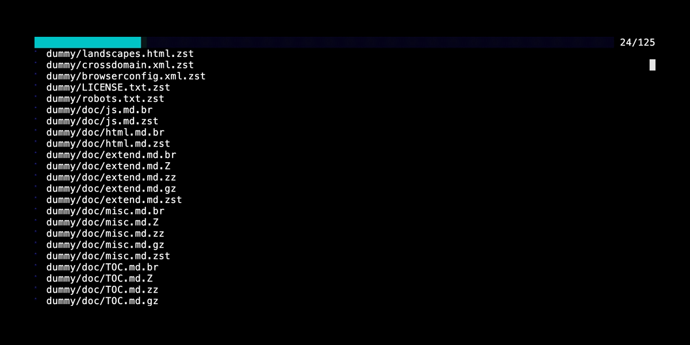

# webcomp

**webcomp** (WEB COMPressor) is a command-line tool that compresses files into multiple formats, including Brotli,
Compress (LZW), Deflate, Gzip, and Zstandard. It generates pre-compressed files for hosting on web servers, reducing
bandwidth usage and improving performance.

[](https://github.com/koma-private/webcomp)
[](https://github.com/koma-private/webcomp)
[](https://crates.io/crates/webcomp)



## Features

- **Multi-Format Compression**: Supports Brotli, Compress (LZW), Deflate, Gzip, and Zstandard.

- **Efficiency-Oriented**: Automatically skips files if compression results in larger sizes.

- **Dry Run Mode**: Preview compression or cleaning operations without making changes.

- **Detailed Reports**: Provides a summary of compressed, errored, and skipped files.

- **Multi-Threaded**: Parallel processing for faster compression.

- **Broad File Support**: Handles a wide range of file types including CSS, HTML, JSON, and more.

- **Cross-Platform Builds**: Binaries for Windows, macOS, and Linux.

## Supported File Types

`webcomp` processes files based on their extensions only. Supported extensions include:

- **Text files**: CSS, CSV, HTML, JS, JSON, MAP, MD, SGML, SVG, TSV, TXT, WASM, XHTML, XML, XSLT, YAML, MATHML.

---

## Usage

- `webcomp` will not generate a compressed file if the compressed file's size is larger than the original file. This
  behavior ensures that unnecessary larger files are not created.
- `webcomp` also supports a "Dry Run Mode," allowing users to preview which files will be compressed or deleted without
  performing the actual operation. To enable this mode, pass `--dry-run` as a command-line option.
- In addition, `webcomp` generates a detailed report after compression or cleaning operations. The report includes:
    - **Compressed files**: Files successfully compressed.
    - **Errored files**: Files that encountered errors during compression or file I/O.
    - **Skipped files**: Files skipped because their compressed size exceeded the original size.

*Compressing [dummy-static-website](https://github.com/GurvanKervern/dummy-static-website)*


## Command Line Options

```shell
webcomp [options]
```

| Short Option | Long Option              | Value                      | description                                                                                                       |
|--------------|--------------------------|----------------------------|-------------------------------------------------------------------------------------------------------------------|
| -p           | --path                   | `<PATH>`                   | Specify one or more paths to compress.                                                                            |
| -b           | --brotli                 |                            | Enable Brotli compression.                                                                                        |
|              | --clean                  |                            | Remove existing compressed files.                                                                                 |
| -c           | --compress               |                            | Enable Compress (LZW) compression.                                                                                |
|              | --compress-min-code-size | `<COMPRESS_MIN_CODE_SIZE>` | Minimum code size for LZW compression. Must be 8 or greater. Default: `8`                                         |
| -d           | --deflate                |                            | Enable Deflate compression.                                                                                       |
|              | --dry_run                |                            | Enable dry run mode. Show what would be compressed and its estimated size reduction without actually compressing. |
| -g           | --gzip                   |                            | Enable Gzip compression.                                                                                          |
|              | --max-threads            | `<MAX_THREADS>`            | Maximum threads for parallel processing. Default: `10`                                                            |
| -V           | --version                |                            | Display version information and exit.                                                                             |
| -z           | --zstd                   |                            | Enable Zstandard compression.                                                                                     |
|              | --zstd-level             | `<ZSTD_LEVEL>`             | Set Zstandard compression level (range: `1`-`22`). Default: `10`                                                  |
| -h           | --help                   |                            | Display help information.                                                                                         |
| -h           | --dry-run                |                            | Perform a dry run without making changes (for compression or cleaning).                                           |

---

## Examples

- Display version information:

```shell
webcomp --version
```

- Compress files in specific directories using Brotli and Deflate:

```shell
webcomp -p ./public -p ./dist --brotli --deflate
```

- Perform a dry run to preview compression:

```shell
webcomp -p ./public -p ./dist --brotli --dry-run
```

- Compress files with multiple algorithms and custom Zstandard level:

```shell
webcomp -p ./assets --brotli --gzip --zstd --zstd-level 15
```

- Clean existing compressed files:

```shell
webcomp --clean -p ./public -p ./dist
```

- Perform a dry run to preview file cleaning:

```shell
webcomp --clean --dry-run -p ./public -p ./dist
```

---

## Build Instructions

### Prerequisite

- Install the Rust programming language. See [Rust installation guide](https://www.rust-lang.org/tools/install).

### Build for Different Platforms

#### Windows (MSVC)

1. Setup a build environment.
   See [Microsoft guide](https://learn.microsoft.com/ja-jp/windows/dev-environment/rust/setup).
2. Install the Rust toolchain `stable-x86_64-pc-windows-msvc`
3. Run the build script

```shell
build-win.cmd
```

4. The executable will be located in `target-win/release`

#### MacOS (Universal Binary)

1. Install Xcode command line tools:

```shell
xcode-select --install
```

2. Install Rust targets:

```shell
rustup target add x86_64-apple-darwin aarch64-apple-darwin
```

3. Run the build script

```shell
./build-mac.sh
```

4. The executable will be located in `dist-mac`

### Linux (musl libc)

1. Install Docker. See [Docker installation guide](https://docs.docker.com/engine/install/).
2. Run the build script

```shell
./build-linux.sh
```

3. Executable will be located in `target-docker/release`

---

## Acknowledgments

`webcomp` relies on the following open-source projects:

- [anyhow](https://github.com/dtolnay/anyhow): Error handling.
- [brotli](https://github.com/dropbox/rust-brotli): Brotli compression.
- [clap](https://github.com/clap-rs/clap): Command-line argument parsing.
- [clap-help](https://github.com/Canop/clap-help): Extended help formatting.
- [flate2](https://github.com/rust-lang/flate2-rs): Gzip and Deflate compression.
- [indicatif](https://github.com/console-rs/indicatif): Progress indicators.
- [lazy-regex](https://github.com/Canop/lazy-regex): Regex compilation.
- [lzw](https://github.com/nwin/lzw): LZW compression.
- [rust_search](https://github.com/ParthJadhav/rust_search): File searching.
- [threadpool](https://github.com/rust-threadpool/rust-threadpool): Multi-threading.
- [zstd](https://github.com/gyscos/zstd-rs): Zstandard compression.

## License

`webcomp` is licensed under the [MIT license](LICENSE).
